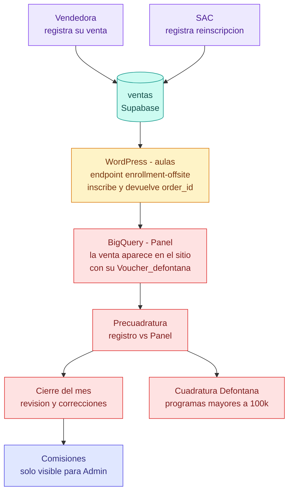
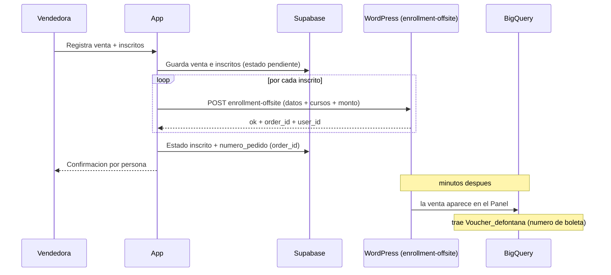
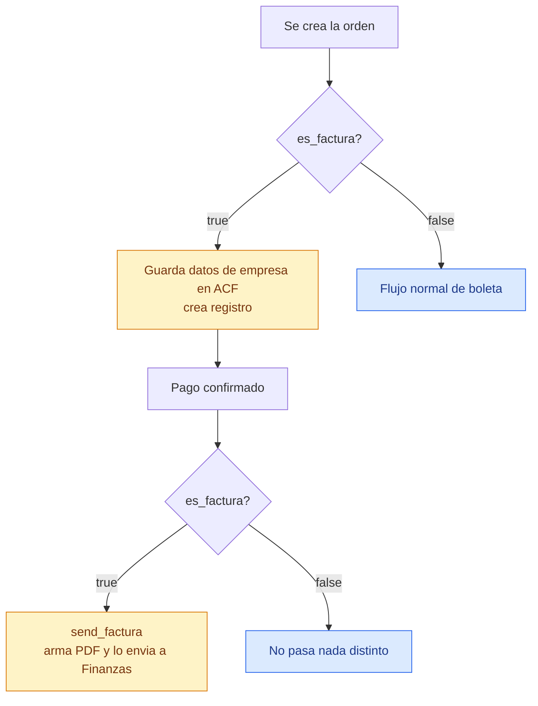
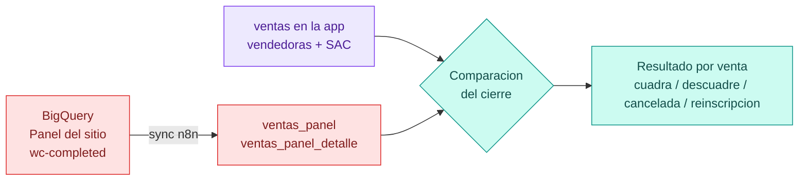
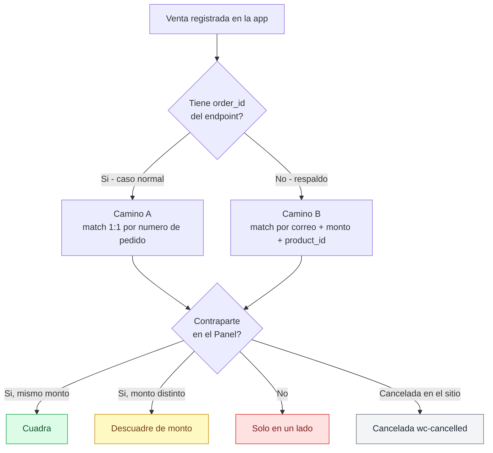
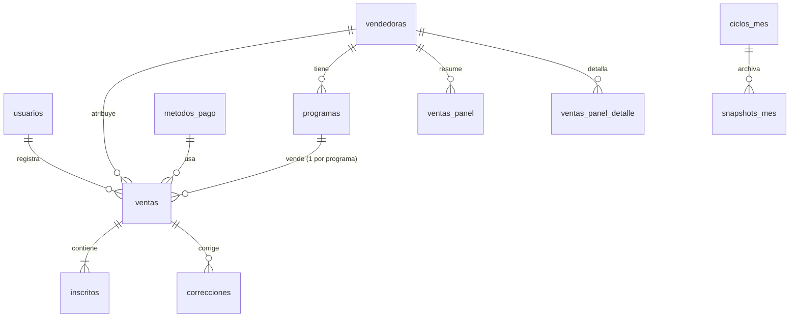
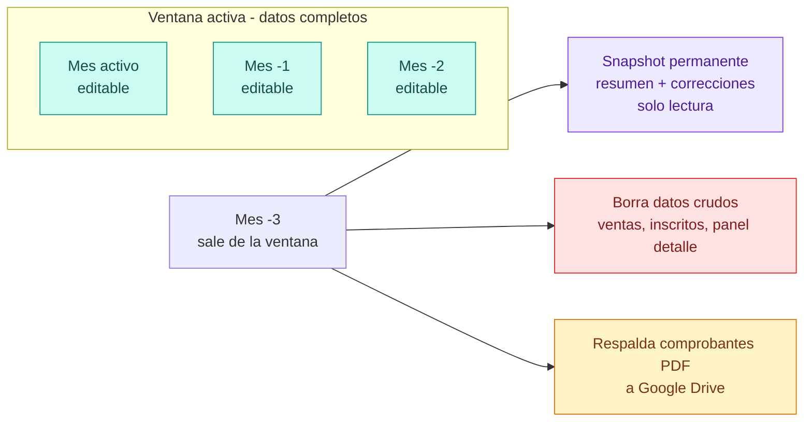
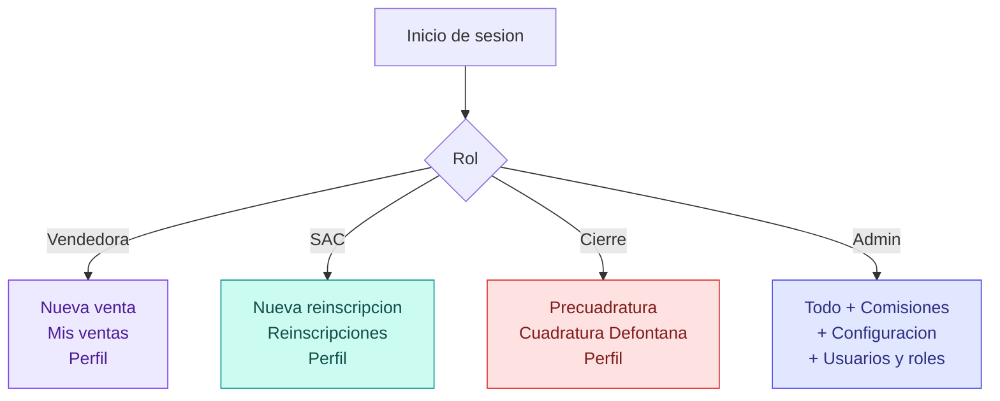
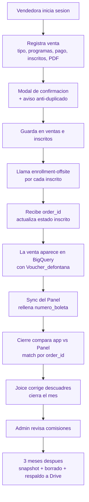

# Plataforma Adipa — Ventas, Inscripciones y Comisiones

> Documento de arquitectura. Define la plataforma completa antes de implementar: visión, módulos, modelo de datos, endpoints, páginas por rol, flujos, lógica de negocio y decisiones de diseño.

---

## Índice

1. [Visión general](#1-visión-general)
2. [Stack tecnológico](#2-stack-tecnológico)
3. [Frente 1 — Registro de ventas](#3-frente-1--registro-de-ventas)
4. [Frente 2 — Automatización de inscripciones](#4-frente-2--automatización-de-inscripciones)
5. [Frente 3 — Cierre de ventas y comisiones](#5-frente-3--cierre-de-ventas-y-comisiones)
6. [Modelo de datos](#6-modelo-de-datos)
7. [Retención y archivado](#7-retención-y-archivado)
8. [Roles y navegación](#8-roles-y-navegación)
9. [Páginas](#9-páginas)
10. [Endpoints](#10-endpoints)
11. [Flujo de punta a punta](#11-flujo-de-punta-a-punta)
12. [Decisiones de arquitectura](#12-decisiones-de-arquitectura)
13. [Pendientes por confirmar](#13-pendientes-por-confirmar)

---

## 1. Visión general

La plataforma unifica en una sola aplicación tres procesos que hoy viven separados entre Monday, WordPress y planillas manuales. El principio rector: **una venta nace dentro de la aplicación y fluye sola** hasta el cierre, en vez de registrarse a mano en un sistema y reconciliarse a la fuerza en otro.

Los tres frentes:

1. **Registro de ventas** — las vendedoras y SAC registran las ventas fuera del sitio que requieren inscripción manual, directamente en la app. Reemplaza el registro actual en Monday.
2. **Automatización de inscripciones** — al registrarse una venta, la app inscribe automáticamente a cada persona en el aula de WordPress mediante un endpoint que ya existe, eliminando la intervención manual del equipo de TI.
3. **Cierre de ventas y comisiones** — la precuadratura mensual compara lo registrado en la app contra el Panel del sitio (BigQuery), identifica descuadres, permite corregirlos y calcula la comisión de cada vendedora.

Los tres frentes comparten la misma base de datos, los mismos usuarios y el mismo catálogo de programas y vendedoras. No son tres aplicaciones: es una sola con tres secciones que se muestran según el rol.



### Por qué esta arquitectura reduce los descuadres

Hoy una venta manual nace en Monday (la escribe la vendedora) y muere en BigQuery (cuando TI la inscribe en el aula). Dos orígenes distintos, llenados por personas diferentes en momentos diferentes; el cierre tiene que reconciliarlos, y de ahí vienen la mayoría de los descuadres.

Cuando la venta nace en la app y se inscribe sola por el endpoint, el lado "manual" y el lado "sitio" pasan a tener el mismo origen y un identificador común (`order_id`). Los descuadres manuales —hoy el grueso del trabajo de cierre— casi desaparecen.

---

## 2. Stack tecnológico

| Capa | Tecnología |
|---|---|
| Framework | Next.js 16 (App Router) |
| Base de datos | Supabase (PostgreSQL + Auth + RLS) |
| Hosting / Crons | Vercel |
| Datos del sitio | BigQuery, vía flujos de n8n |
| Inscripción en aulas | Endpoint WordPress `enrollment-offsite` (uno por país) |
| Almacenamiento de comprobantes | Supabase Storage, respaldo a Google Drive al archivar |

---

## 3. Frente 1 — Registro de ventas

### 3.1 Descripción

Las vendedoras y el equipo de SAC registran ventas directamente en la app, reemplazando el registro en tableros de Monday.

### 3.2 Tipos y orígenes de venta

Cada venta se etiqueta al registrarse con dos atributos que la acompañan todo su ciclo de vida:

**Origen** (quién la registra y cómo se atribuye):
- **Vendedora** — se atribuye a esa vendedora y genera comisión.
- **SAC** — reinscripciones y pagos por transferencia; no se atribuyen a ninguna vendedora, no generan comisión, pero igual se inscriben en el aula y aparecen en el cierre.

**Tipo** (estructura de la venta):
- **Individual** — sin nombre de empresa, uno o más inscritos.
- **Empresa** — con nombre e identificador fiscal de la empresa, uno o más inscritos.

### 3.3 Formulario de registro

Un selector inicial de tipo (Individual / Empresa) muestra u oculta los campos de empresa. El resto es igual.

**Datos de la empresa** (solo si tipo = Empresa):
- Nombre de la empresa
- Identificador fiscal de la empresa

**Datos del pago:**
- Programa(s) — selector alimentado desde la tabla `programas`, filtrado por la vendedora autenticada (`programas.vendedora_id`). **Soporta multi-programa**: una persona puede inscribirse en varios. Al elegir cada programa se toma su `wp_post_id` de esa misma tabla.
- Monto — en una venta a un grupo o empresa (varias personas en el mismo programa) se ingresa el monto total de esa venta. Si en cambio una persona compra varios programas distintos, se usa el selector multi-programa y se ingresa el monto de cada programa por separado (cada programa es una venta independiente).
- Cupón de descuento (opcional)
- Comprobante en PDF
- Fecha de venta

**Personas a inscribir** (mínimo una, botón para agregar más):
- Nombre, apellido, identificador fiscal, celular, correo.

El identificador fiscal se etiqueta según el país de la vendedora: **RUT** en Chile, **RFC** en México, **NIT / cédula** en Colombia. El campo es el mismo en la base de datos; solo cambia la etiqueta visible.

> **Multi-programa vs. grupo.** Son dos cosas distintas. Un **grupo o empresa** (varias personas en el mismo programa) es **una sola venta** con su monto total y varios inscritos. En cambio, **una persona que compra varios programas** genera **una venta por programa**: cada una con su propio monto, su llamada al endpoint y su `order_id`, lo que la hace cuadrar 1:1 contra el Panel.

### 3.4 Confirmación y anti-duplicado

No hay edición de una venta ya enviada. Antes de enviar, un **modal de confirmación** muestra todos los datos (venta, programas, inscritos) para revisar que estén correctos.

Al confirmar, la app revisa si ya existe ese **correo + programa en el mes**. Si existe, muestra una **advertencia** ("Ya registraste a esta persona en este programa el [fecha]. ¿Continuar?") pero **no bloquea** — puede ser una reinscripción legítima.

### 3.5 Historial

Cada vendedora y SAC ve su historial **por mes**, con el estado de inscripción de cada venta. El estado de cada inscrito refleja lo que devolvió el endpoint al matricular (`ok` → inscrito; fallo → error con su mensaje). Al abrir una venta se ve el detalle de cada persona y su estado individual, con opción de **reintentar** la inscripción de quienes fallaron. Reintentar vuelve a llamar al mismo flujo de inscripción (`enrollment-offsite`) solo para los inscritos en estado error, y actualiza su estado con la nueva respuesta.

---

## 4. Frente 2 — Automatización de inscripciones

### 4.1 Descripción

Al guardar una venta, la app dispara automáticamente la inscripción en el aula de WordPress, una llamada por persona. Reemplaza el trabajo manual de TI.

> **El endpoint ya existe.** Es `enrollment-offsite` (ej. `https://adipa.mx/api/n8n/enrollment-offsite`), uno por país. No hay que crearlo desde cero. El aula se resuelve del lado de WordPress a partir del `wp_post_id` del curso — la app **no** necesita conocer ni enviar el id de aula.

### 4.2 Secuencia



### 4.3 Contrato del endpoint

**Payload de entrada** (confirmado con un caso real):

```json
{
  "first_name": "Esperanza Aidé",
  "last_name": "Reyna Cuevas",
  "rut": "RECE770311FN4",
  "phone": "4423865565",
  "email": "airecu@hotmail.com",
  "total": 500,
  "date": "2026-06-23",
  "tipo": "00T",
  "metodo_pago_label": "Transferencia bancaria",
  "coupon": null,
  "cursos": ["21308717"],
  "source": "monday_offsite"
}
```

**Respuesta** (confirmada):

```json
{
  "ok": true,
  "message": "Matriculación completada",
  "user_id": 86344,
  "order_id": 21363412,
  "type": "00T",
  "tipo_label": "Transferencia",
  "amount_cart": 500,
  "total_csv": 500
}
```

**Mapeo de campos:**

| Payload / Respuesta | Origen / destino en la app |
|---|---|
| `first_name`, `last_name` | inscrito.nombre, inscrito.apellido |
| `rut` | inscrito.identificador_fiscal |
| `phone`, `email` | inscrito.celular, inscrito.correo |
| `total` | venta.monto_total |
| `date` | venta.fecha_venta |
| `tipo` + `metodo_pago_label` | metodos_pago.codigo + metodos_pago.label |
| `coupon` | venta.cupon |
| `cursos` (array) | venta.wp_post_id por cada programa |
| `source` | trazabilidad de origen (ej. `app_offsite`) |
| **`order_id`** (respuesta) | **venta.numero_pedido** → clave del match |
| `user_id` (respuesta) | referencia opcional |

### 4.4 Manejo de errores

Si una inscripción falla, la venta queda en estado **parcial** o **error** con el mensaje del fallo. La vendedora puede **reintentar solo las personas que fallaron**, sin rehacer toda la venta.

### 4.5 Ventas empresa — facturación nativa (dependencia con TI)

Una venta de tipo **empresa** no debe generar boleta: debe generar **factura**. Investigando el sitio se confirmó que este comportamiento **ya existe de forma nativa** en la pasarela de pago, mediante una variable `es_factura`:

- Al crear la orden, si `es_factura` está marcado, el sitio guarda los datos de la empresa en un campo ACF y crea un registro asociado.
- Al confirmarse el pago, si `es_factura` es `true`, se dispara un envío (`send_factura`) que arma el PDF de la factura y lo envía por correo al área de Finanzas. No se genera boleta.
- Si `es_factura` es `false` (caso normal, individual), no pasa nada distinto: sigue el flujo de boleta.



> **⚠️ Dependencia bloqueante confirmada con TI (Dylan).** El endpoint `enrollment-offsite` que existe **hoy no acepta** `es_factura` ni los datos de la empresa — solo está construido para boletas de venta individual. Dylan confirmó que **debe actualizar el endpoint** para que reciba ambos. Mientras esa actualización no esté lista, **el Frente 2 no puede procesar ventas de empresa** de forma automática.

**Implicancia de diseño — lanzamiento por fases:**

- **Fase A (ya viable hoy):** Frente 1 y 2 completos para ventas **individuales**. El endpoint actual las soporta sin cambios.
- **Fase B (bloqueada por TI):** ventas **empresa**, una vez que Dylan actualice el endpoint para aceptar `es_factura` + datos de empresa. Hasta entonces, las ventas empresa pueden registrarse en la app (Frente 1) pero su inscripción/facturación seguiría el proceso manual actual de TI, o quedar pendientes de envío automático hasta que el endpoint esté listo.

> Nota de proceso descartada: se evaluó enviar `total: 0` al endpoint para evitar la doble emisión de boleta en empresas, pero se descartó — el riesgo era que la factura también saliera en $0. El mecanismo correcto es el flag `es_factura` nativo de la pasarela, no manipular el monto.

### 4.6 Interruptor de inscripción automática (`INSCRIPCION_AUTOMATICA`)

Mientras TI ajusta la lógica del backend del sitio, **no se debe llamar al endpoint real `enrollment-offsite` bajo ninguna circunstancia** — ni para ventas individuales. La variable de entorno `INSCRIPCION_AUTOMATICA` controla esto (default `false` si no está seteada o si vale cualquier cosa distinta de `'true'`):

- **`false` (estado actual)** — `/api/inscribir` y `/api/inscribir/reintentar` **no llaman** a `enrollmentUrl`. La venta y sus inscritos quedan en `estado_inscripcion = 'pendiente'`, con `mensaje_error = 'INSCRIPCION_AUTOMATICA_DESACTIVADA'` (constante `MARCADOR_INSCRIPCION_DESACTIVADA` en `lib/types.ts`) para distinguirlo de un error real. El formulario, el historial y el detalle de venta muestran un aviso claro en vez de un estado ambiguo.
- **`true`** — funciona como antes: llama al endpoint real por país y procesa la respuesta normalmente.

Para reactivar la inscripción automática, cambiar el valor en Vercel a `true` y redeploy — no requiere cambios de código.

---

## 5. Frente 3 — Cierre de ventas y comisiones

### 5.1 Descripción

La precuadratura mensual compara las ventas registradas en la app contra el Panel del sitio con estado `wc-completed` (BigQuery), identifica descuadres, permite resolverlos y calcula comisiones. Es la evolución del cierre actual: el lado "manual" ya no viene de Monday sino de la tabla `ventas` de la propia app.

### 5.2 Fuentes de datos



El Panel se sincroniza desde BigQuery vía n8n e incluye tanto las ventas automáticas del sitio como las manuales ya inscritas. El sync corre **diariamente en la madrugada**, con un **botón de actualización inmediata** para que la vendedora confirme que su venta ya llegó al sitio.

El **número de boleta** sale del campo `Voucher_defontana` de BigQuery: el sync del Panel lo rellena en la venta cruzando por número de pedido (`order_id` ↔ `Id_oc`).

### 5.3 Lógica de matching

El criterio depende de lo que devuelva el endpoint. Como `enrollment-offsite` **sí devuelve `order_id`**, el camino principal es el match por número de pedido. El segundo camino queda como respaldo para datos sin order_id (históricos o cargas manuales antiguas).



**Camino A — con número de pedido (normal).** Match uno a uno por `numero_pedido` (= `order_id` = `Id_oc` en BigQuery). Es el más confiable.

**Camino B — sin número de pedido (respaldo).** Match por **correo + monto + product_id (wp_post_id)**.

Clasificación común a ambos caminos: contraparte con mismo monto → **Cuadra**; monto distinto → **Descuadre de monto**; sin contraparte → **Solo en un lado**.

**Ventas manuales empresariales.** Donde el Panel agrupa el lote en una fila y la app tiene una persona por fila, se agrupan las personas de la app por programa y monto y se compara el total del grupo contra la fila del Panel.

**Reinscripciones (SAC).** Se registran en la app igual que una venta y se inscriben por el **mismo endpoint `enrollment-offsite`** (por país, ej. `https://adipa.cl/api/n8n/enrollment-offsite`), que también devuelve `order_id`. Lo que las distingue de una venta normal no es el endpoint sino el origen: no se atribuyen a ninguna vendedora. Por eso el match contra el Panel es por **`order_id`**, igual que las ventas — no depende de heurísticas frágiles de correo + monto. Se excluyen del descuadre de la vendedora y se muestran aparte como no atribuidas.

### 5.4 Cancelaciones

El cierre no tiene un flujo manual de cancelación. El sync de BigQuery detecta cuando una venta que teníamos como pagada aparece con `wc-cancelled` (cruzando por número de pedido) y la marca como **cancelada**. Solo se refleja en el cierre; la vendedora no recibe aviso.

### 5.5 Correcciones

Ante un descuadre, el usuario de cierre puede:
- **Editar el monto** de cualquiera de los dos lados (app o Panel).
- **Enlazar manualmente** una o más filas de un lado con una o más del otro, cuando el algoritmo no detectó el match.
- **Marcar como revisado** un caso que no requiere acción.

Toda corrección queda registrada con motivo, autor y fecha. Las correcciones se pueden **deshacer**.

### 5.6 Cuadratura Defontana (segunda etapa)

Para los programas de mayor valor (> $100.000) se hace una segunda cuadratura contra Defontana. Como Defontana no tiene API (por confirmar), el usuario de cierre descarga un Excel y lo sube a la app, que hace el match contra los programas usando el `id_defontana` de cada programa.

### 5.7 Comisiones

Sobre las ventas validadas en el cierre se calcula la comisión de cada vendedora aplicando su porcentaje. **Estas columnas (porcentaje y monto de comisión) son visibles únicamente para el rol Admin** — ni vendedoras, ni SAC, ni cierre las ven. El porcentaje se guarda por vendedora (fijo, por confirmar si varía por programa o país).

---

## 6. Modelo de datos

Conjunto nuevo de tablas. No se reutiliza el esquema actual basado en Monday.



### Catálogo y usuarios

**`usuarios`** — quién entra y con qué rol.
`id`, `nombre`, `email`, `rol` (admin / vendedora / sac / cierre), `activo`, `creado_en`.

**`vendedoras`** — el equipo comercial.
`id`, `nombre`, `pais` (CL / MX / CO), `moneda`, `comision_porcentaje`, `activo`.

**`programas`** — catálogo alimentado desde BigQuery.
`id`, `wp_post_id`, `nombre`, `tipo`, `vendedora_id`, `id_defontana`, `pais`, `activo`.

**`metodos_pago`** — opciones del desplegable (no hardcodeadas).
`id`, `codigo` (ej. `00T`), `label` (ej. `Transferencia bancaria`), `activo`.

### Registro (Frente 1 y 2)

**`ventas`** — el corazón de la plataforma. Una fila por venta-programa.
`id`, `origen` (vendedora / sac), `vendedora_id` (nulo si SAC), `tipo` (empresa / individual), `es_factura` (true si tipo = empresa, se envía al endpoint), `nombre_empresa`, `identificador_fiscal_empresa`, `programa_id`, `wp_post_id`, `metodo_pago_id`, `monto_total`, `cupon`, `comprobante_url`, `fecha_venta`, `mes`, `numero_pedido`, `numero_boleta`, `numero_factura`, `estado_inscripcion` (pendiente / inscrito / parcial / error / cancelado), `creado_por`, `creado_en`, `actualizado_en`.

**`inscritos`** — las personas de cada venta.
`id`, `venta_id`, `nombre`, `apellido`, `identificador_fiscal`, `celular`, `correo`, `estado_inscripcion` (pendiente / inscrito / error), `mensaje_error`, `numero_pedido`, `numero_boleta`, `numero_factura`.

### Panel (Frente 3, desde BigQuery)

**`ventas_panel`** — totales por vendedora y mes.
`id`, `vendedora`, `mes`, `pais`, `sw_monto`, `sw_cantidad`, `sw_auto_monto`, `sw_auto_cantidad`, `sw_no_auto_monto`, `sw_no_auto_cantidad`.

**`ventas_panel_detalle`** — detalle venta por venta.
`id`, `vendedora`, `mes`, `wp_post_id`, `programa`, `numero_orden`, `monto`, `num_lotes`, `categoria`, `correo_cliente`, `nombre_cliente`, `apellido_cliente`, `voucher`, `ultimo_estado`, `fecha`, `pais`.

### Control y auditoría

**`ciclos_mes`** — mes activo y archivados.
`id`, `mes`, `estado` (activo / archivado), `creado_en`.

**`correcciones`** — toda intervención manual del cierre.
`id`, `tipo` (edicion_monto / enlace_manual / ignorado), referencias a las ventas o filas, `valor_anterior`, `valor_nuevo`, `motivo`, `usuario`, `fecha`.

**`snapshots_mes`** — foto inmutable de cada mes archivado.
`id`, `mes`, `pais`, `resumen_precuadratura` (jsonb), `correcciones` (jsonb), `total_vendido`, `total_descuadres`, `generado_en`, `generado_por`.

**`sync_log`** — registro de cada sincronización.
`id`, `flujo`, `resultado`, `detalle`, `fecha`.

---

## 7. Retención y archivado

Para no agotar la cuota de la base de datos, solo se mantienen con datos completos el **mes activo y los dos anteriores**. Cuando un mes sale de esa ventana se archiva por foto.



Antes de borrar, se genera un snapshot en `snapshots_mes` que congela la precuadratura final y el detalle de correcciones. Luego se borran los datos crudos del mes en las tablas operativas. Al consultar un mes archivado, la app lee del snapshot: ve la precuadratura final y las correcciones para auditoría, pero no el detalle venta por venta. Los comprobantes PDF se respaldan a Google Drive antes de borrarse de Supabase Storage.

---

## 8. Roles y navegación

El rol se lee al iniciar sesión y determina qué barra y qué pantallas se muestran.



| Sección | Vendedora | SAC | Cierre | Admin |
|---|:---:|:---:|:---:|:---:|
| Nueva venta | ✅ | — | — | ✅ |
| Mis ventas | ✅ | — | — | ✅ |
| Nueva reinscripción | — | ✅ | — | ✅ |
| Reinscripciones registradas | — | ✅ | — | ✅ |
| Precuadratura | — | — | ✅ | ✅ |
| Cuadratura Defontana | — | — | ✅ | ✅ |
| **Comisiones** | — | — | — | ✅ |
| Configuración | — | — | — | ✅ |
| Usuarios y roles | — | — | — | ✅ |
| Perfil | ✅ | ✅ | ✅ | ✅ |

---

## 9. Páginas

| Ruta | Descripción | Acceso |
|---|---|---|
| `/login` | Inicio de sesión | Público |
| `/registro` | Formulario de nueva venta | Vendedora, Admin |
| `/registro/historial` | Historial de ventas propias (por mes) | Vendedora, Admin |
| `/reinscripciones` | Formulario de nueva reinscripción | SAC, Admin |
| `/reinscripciones/historial` | Reinscripciones registradas | SAC, Admin |
| `/venta/[id]` | Detalle de una venta con sus inscritos | Según permiso |
| `/precuadratura` | Tabla principal del cierre, agrupada por país: **Sitio Web** (informativo, no se compara), **Fuera de Sitio — BigQuery** (con ⚠ si no coincide con el resumen del sync), **Fuera de Sitio — App** (tooltip con desglose Individual/Empresa), y **Δ** = BigQuery − App (define Cuadra/Descuadra). Incluye grupo aparte para SAC (no atribuidas) | Cierre, Admin |
| `/precuadratura/[vendedora]` | Drill-down venta por venta de una vendedora (o `sac` para las no atribuidas), con la clasificación de cada una (Cuadra / Descuadre de monto / Solo en un lado / Cancelada). Las correcciones manuales (edición de monto, enlace manual, marcar revisado) quedan pendientes para una siguiente etapa | Cierre, Admin |
| `/cuadratura-defontana` | Segunda etapa de cuadratura | Cierre, Admin |
| `/comisiones` | Cálculo de comisión por vendedora | Admin |
| `/archivo/[mes]` | Vista de un mes archivado (snapshot) | Cierre, Admin |
| `/configuracion` | Gestión de vendedoras y programas. Incluye carga manual del Excel de Defontana (matching de `id_defontana` por nombre, resolución de ambiguos eligiendo el candidato correcto, y listado de programas de Chile aún sin `id_defontana` para asignarlo a mano) | Cierre, Admin |
| `/usuarios` | Gestión de usuarios y roles | Admin |
| `/perfil` | Perfil y cambio de contraseña | Todos |

---

## 10. Endpoints

### Registro e inscripción (Frente 1 y 2)

| Método | Ruta | Descripción |
|---|---|---|
| POST | `/api/ventas/registrar` | Guarda la venta y sus inscritos |
| POST | `/api/inscribir` | Llama a `enrollment-offsite` de WordPress por cada inscrito y guarda `order_id` |
| POST | `/api/inscribir/reintentar` | Reintenta solo los inscritos que fallaron |
| POST | `/api/comprobante/subir` | Sube el PDF a Supabase Storage |
| GET | `/api/ventas/mias` | Historial de ventas del usuario |
| GET | `/api/ventas/[id]` | Detalle de una venta con inscritos |

### Cierre (Frente 3)

| Método | Ruta | Descripción |
|---|---|---|
| GET | `/api/precuadratura?mes=YYYY-MM` | Agrupa por país → vendedora con 4 columnas: `monto_sitio_web` (informativo), `monto_bigquery` (detalle `wc-completed`, `sw_auto`+`sw_no_auto`), `monto_app` (con `desglose_tipo` individual/empresa), y `delta` = bigquery − app (define Cuadra/Descuadra). `aviso_integridad` es un campo aparte (chequeo interno resumen-vs-detalle, no es el descuadre). Incluye grupo SAC aparte |
| GET | `/api/vendedora/[id]/ventas?mes=YYYY-MM` | Detalle venta por venta de una vendedora (`[id]` = UUID) o de las no atribuidas (`[id]` = `sac`), cada una clasificada. El descuadre por vendedora ya viene incluido acá y en `/api/precuadratura` — no hay endpoint separado |
| POST | `/api/corregir` | Edición de monto, enlace manual o marcar revisado |
| GET | `/api/comisiones` | Cálculo de comisiones (solo Admin) |
| GET | `/api/cuadratura-defontana` | Cuadratura de programas mayores contra Defontana (por definir — pendiente, distinto de la carga de `id_defontana` ya implementada en `/configuracion`) |
| GET | `/api/archivo/[mes]` | Lee el snapshot de un mes archivado |

### Sincronización y mantenimiento

| Método | Ruta | Descripción | Protección |
|---|---|---|---|
| POST | `/api/sync/programas` | Recibe el listado de programas (CL/MX/CO) enviado por un flujo de n8n que consulta BigQuery; hace upsert y desactiva los que no vienen | CRON_SECRET |
| POST | `/api/sync/defontana` | Recibe `{ id_servicio, descripcion }[]` desde n8n (hoja de Sheets de Defontana, solo aplica a CL); matchea por nombre normalizado y guarda `id_defontana`. Ambiguos o sin match quedan en `sync_log` para revisión manual | CRON_SECRET |
| POST | `/api/configuracion/defontana/upload` | Carga manual del Excel de Defontana desde `/configuracion` (columnas "ID Servicio" y "Descripción", parseado con `exceljs`). Misma lógica de matching que `/api/sync/defontana`; devuelve el resultado directo a la UI en vez de solo loguearlo | Sesión (rol Cierre/Admin) |
| GET | `/api/configuracion/defontana/pendientes` | Lista, agrupados por nombre normalizado, los programas activos de Chile que aún no tienen `id_defontana` | Sesión (rol Cierre/Admin) |
| POST | `/api/configuracion/defontana/asignar` | Asigna manualmente un `id_defontana` a un grupo de programas (todas las filas de Chile con ese nombre). Usado tanto por la lista de pendientes como al resolver un caso ambiguo eligiendo el candidato correcto | Sesión (rol Cierre/Admin) |
| POST | `/api/sync/panel` | Recibe totales por vendedora/mes/país (`ventas_sw_monto`, `ventas_sw_auto_monto`, `ventas_sw_no_auto_monto`, y sus cantidades) enviados por n8n; upsert en `ventas_panel` por `(vendedora, mes, pais)` | CRON_SECRET |
| POST | `/api/sync/panel-detalle` | Recibe el detalle venta por venta (fuera de sitio, `SW_Auto`/`SW_no_auto`) enviado por n8n; upsert en `ventas_panel_detalle` por **`(numero_orden, wp_post_id)`** — una orden de WooCommerce puede traer más de un producto en el carrito, y cada línea es una fila distinta. Efectos secundarios: rellena `ventas.numero_boleta` desde `voucher`, y marca `ventas.estado_inscripcion = 'cancelado'` cuando `ultimo_estado = 'wc-cancelled'` | CRON_SECRET |
| POST | `/api/sync/forzar` | Actualización inmediata del Panel | Auth |
| GET/POST | `/api/ciclos/rotar` | Rotación de mes + genera snapshot + respalda PDFs | CRON_SECRET |
| GET | `/api/programas` | Listado de programas por vendedora | Auth |

### 10.1 Queries de BigQuery para el sync del Panel (configurar en n8n)

Las 3 categorías del Panel son independientes entre sí:
- **`ventas_sw_monto`** (`Type_sold = 'SW'`) — vendido *dentro* del sitio, automático, no pasa por esta app. Se guarda para comisiones futuras; **no se usa en ningún cálculo de la precuadratura**.
- **`ventas_sw_auto_monto` + `ventas_sw_no_auto_monto`** (`SW_Auto` / `SW_no_auto`) — vendido *fuera* del sitio, ingresado vía esta app e inscrito por `enrollment-offsite`. Es lo único que se compara contra `ventas`.

**Query de totales** (para `/api/sync/panel`, ya filtrada a `wc-completed` — es un resumen):

```sql
SELECT 
  Seller_name,
  FORMAT_DATE('%Y-%m', Fecha) as mes,
  Pais,
  SUM(CASE WHEN Type_sold = 'SW' THEN Total_cash ELSE 0 END) as ventas_sw_monto,
  COUNT(CASE WHEN Type_sold = 'SW' THEN 1 END) as ventas_sw_cantidad,
  SUM(CASE WHEN Type_sold = 'SW_Auto' THEN Total_cash ELSE 0 END) as ventas_sw_auto_monto,
  COUNT(CASE WHEN Type_sold = 'SW_Auto' THEN 1 END) as ventas_sw_auto_cantidad,
  SUM(CASE WHEN Type_sold = 'SW_no_auto' THEN Total_cash ELSE 0 END) as ventas_sw_no_auto_monto,
  COUNT(CASE WHEN Type_sold = 'SW_no_auto' THEN 1 END) as ventas_sw_no_auto_cantidad
FROM `adipa-cl-331013.desarrollo_pruebas_adipa.ventas_producto_resumen_panel_v5`
WHERE Fecha >= DATE_TRUNC(DATE_SUB(CURRENT_DATE(), INTERVAL 1 MONTH), MONTH)
  AND Seller_name IS NOT NULL
  AND Type_sold IN ('SW', 'SW_Auto', 'SW_no_auto')
  AND Total_cash > 0
  AND Status_oc = 'wc-completed'
GROUP BY Seller_name, mes, Pais
ORDER BY Seller_name, mes
```

**Query de detalle** (para `/api/sync/panel-detalle`, **sin** filtro de `Status_oc` — trae completadas y canceladas, necesario para detectar cancelaciones posteriores; ya viene limitada a `SW_Auto`/`SW_no_auto`, coherente con lo que se compara contra `ventas`):

```sql
SELECT
  Seller_name as vendedora,
  FORMAT_DATE('%Y-%m', MIN(Fecha)) as mes,
  CAST(Product_id AS STRING) as wp_post_id,
  Name_item as programa,
  CAST(Id_oc AS STRING) as numero_orden,
  SUM(Total_cash) as monto,
  COUNT(*) as num_lotes,
  CASE 
    WHEN Type_sold = 'SW_Auto' THEN 'sw_auto'
    WHEN Type_sold = 'SW_no_auto' THEN 'sw_no_auto'
  END as categoria,
  MAX(Cust_email) as correo_cliente,
  MAX(Cust_first_name) as nombre_cliente,
  MAX(Cust_last_name) as apellido_cliente,
  MAX(Cust_phone) as telefono,
  MAX(Voucher_defontana) as voucher,
  MAX(Status_oc) as ultimo_estado,
  CAST(MIN(Fecha) AS STRING) as fecha,
  Pais as pais
FROM `adipa-cl-331013.desarrollo_pruebas_adipa.ventas_producto_resumen_panel_v5`
WHERE Fecha >= DATE_TRUNC(DATE_SUB(CURRENT_DATE(), INTERVAL 1 MONTH), MONTH)
  AND Seller_name IS NOT NULL
  AND Type_sold IN ('SW_Auto', 'SW_no_auto')
  AND Total_cash > 0
GROUP BY 
  Seller_name, Product_id, Name_item, Type_sold, 
  Id_oc, Pais, Total_cash
ORDER BY Seller_name, fecha DESC
```

> El campo `telefono` viaja en el JSON de detalle pero **no se persiste** — `ventas_panel_detalle` no tiene esa columna.

### 10.2 Validación de integridad (resumen vs. detalle)

Por cada `(vendedora, mes)`, `/api/precuadratura` compara `ventas_panel.sw_auto_monto + ventas_panel.sw_no_auto_monto` (resumen) contra la suma de `ventas_panel_detalle.monto` filtrado por `ultimo_estado = 'wc-completed'` (detalle). Si difieren, se muestra un aviso ⚠ junto a la columna "Fuera de Sitio — BigQuery" de esa vendedora — no bloquea nada, es solo una alerta de integridad **interna del sync del Panel** (BigQuery contra BigQuery), completamente distinta del Δ (que es BigQuery contra la app). El monto usado para el Δ contra `ventas` es siempre el del **detalle**, no el del resumen.

> **Nota histórica:** el 1 de julio de 2026 se detectó y corrigió un bug donde `/api/sync/panel-detalle` usaba solo `numero_orden` como clave de conflicto del upsert. Cuando una orden de WooCommerce traía más de un producto (ej. un Masterclass gratis + un curso pagado en el mismo carrito), llegaban 2+ líneas con el mismo `numero_orden` y la segunda pisaba a la primera, perdiéndose una venta real — esto explicaba discrepancias reales en la validación de integridad de algunas vendedoras. Corregido usando `(numero_orden, wp_post_id)` como clave compuesta.

---

## 11. Flujo de punta a punta



Una vendedora entra, registra una venta con su(s) programa(s), pago, comprobante e inscritos, y confirma en el modal (con aviso si parece duplicada). La app guarda y dispara la inscripción por cada persona contra `enrollment-offsite`, que devuelve el `order_id`. Minutos después la venta aparece en BigQuery con su `Voucher_defontana`; el sync del Panel rellena el número de boleta. En el cierre, el sistema compara por `order_id` y, gracias al origen común, cuadra automáticamente. Joice corrige los pocos descuadres reales y cierra el mes. El Admin revisa las comisiones. Tres meses después, el mes se archiva en un snapshot inmutable, sus datos crudos se borran y los comprobantes se respaldan a Drive.

---

## 12. Decisiones de arquitectura

- **BigQuery directo, sin intermediario.** El Panel se alimenta de la tabla que usa el sitio, evitando depender de endpoints externos.
- **Monday se reemplaza por completo.** Las ventas manuales y las reinscripciones pasan a nacer en la app.
- **Una venta por programa.** El multi-programa se desdobla; cada venta-programa tiene su `order_id` y cuadra 1:1.
- **El `order_id` es la clave del match.** Lo devuelve `enrollment-offsite`; el Camino B (correo+monto+product_id) es solo respaldo.
- **El número de boleta viene de BigQuery** (`Voucher_defontana`), no del endpoint de inscripción.
- **El aula se resuelve en WordPress** a partir del `wp_post_id`; la app no maneja id de aula.
- **Comisiones gated por Admin.** El cálculo y los porcentajes solo los ve el rol Admin.
- **Retención de 3 meses con snapshot.** Mantiene la base liviana sin perder trazabilidad de auditoría; los PDFs se respaldan a Drive.
- **Lanzamiento por fases.** El Frente 2 sale primero para ventas individuales (el endpoint actual ya las soporta). Empresa queda en una segunda fase, bloqueada hasta que TI actualice el endpoint para aceptar el flag `es_factura` y los datos de empresa.
- **Facturación de empresa por el mecanismo nativo de la pasarela**, no por manipulación de montos. Se descartó enviar monto 0 al endpoint porque arrastraba el riesgo de generar también la factura en cero.

---

## 13. Pendientes por confirmar

| Item | Descripción | Responsable |
|---|---|---|
| **🔴 Endpoint no soporta empresa** | `enrollment-offsite` hoy solo procesa boletas (venta individual). Dylan debe actualizarlo para aceptar `es_factura` + datos de empresa. **Bloquea la Fase B (empresa) del Frente 2.** | Dylan / TI |
| Nombres exactos de campos de empresa | Una vez Dylan actualice el endpoint, confirmar el nombre exacto de `es_factura` y los campos del ACF de empresa para el mapeo del payload | TI |
| Número de factura (empresa) | La factura la emite `send_factura` y se envía por correo a Finanzas — confirmar si además queda registrada en algún sistema consultable (BigQuery, Defontana) para guardar `numero_factura` en la app | TI / Finanzas |
| Mensaje de error "mes distinto" | Confirmado con Finanzas que el mensaje actual ("debe realizarse como factura") está mal — en ese caso es **boleta manual**, no factura. Corregir el texto en el código de n8n | Gonzalo |
| Número de boleta | Confirmado: sale del campo `Voucher_defontana` en BigQuery, vía sync del Panel | ✅ Resuelto |
| Endpoint por país | `enrollment-offsite` confirmado para MX y CL; confirmar la URL de CO | TI |
| Porcentaje de comisión | Confirmar si es fijo por vendedora o varía por programa/país | Joice / Nico |
| Excel de Defontana | Formato confirmado (columnas "ID Servicio" y "Descripción"). Carga manual implementada en `/configuracion`, con matching por nombre y resolución de ambiguos | ✅ Resuelto |
| IDs de Defontana | En curso: se van cargando por programa vía `/configuracion`, tanto por carga masiva del Excel como asignación manual una por una | Joice |
| API de Defontana | Confirmar si existe consulta automática (afecta solo la cuadratura de programas >$100.000, sección 5.6 — no bloquea la carga de `id_defontana` ya construida) | Joice |
| Conexión a Drive | Carpeta y método de respaldo de PDFs | Gonzalo |
| Coordinación rediseño TI | El proceso de inscripciones está siendo reestructurado (Nicolás / Dylan / HubSpot, full automático). Alinear con Matías antes de implementar el Frente 2 para no construir sobre algo que va a cambiar. | Gonzalo / Matías |

